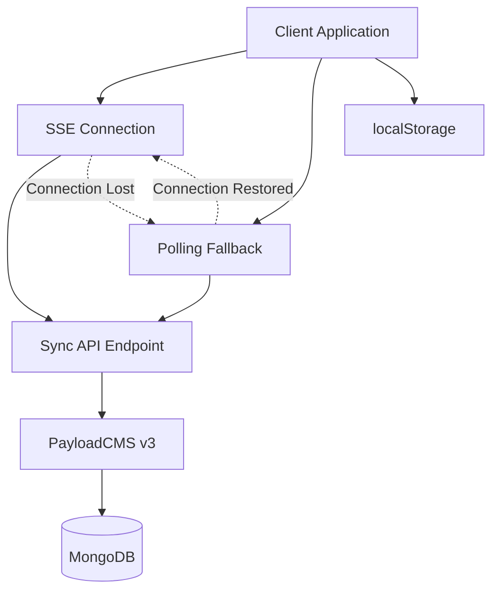
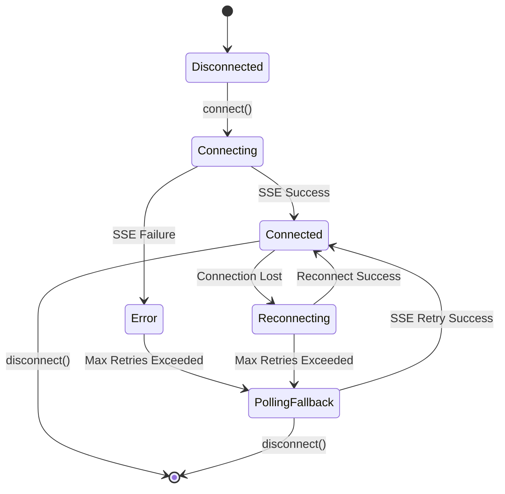

# Central Order Sync System for AX Billing

## Overview

The Central Order Sync System provides real-time synchronization of order data, queue status, and washing bay jobs across all client applications. Built with resilience and performance in mind, it ensures data consistency even during network interruptions, client crashes, and server outages.

### Core Concepts
- **Orders**: Track status changes from initiation to completion
- **Queues**: Manage washing bay availability and scheduling
- **Jobs**: Monitor real-time washing bay operations

## Architecture Summary

The sync system uses a hybrid approach combining Server-Sent Events (SSE) for real-time updates with polling fallback for reliability. All data is persisted locally using localStorage and synchronized through PayloadCMS.



### Key Components

1. **SyncManager**: Core orchestration component
2. **EventSource Factory**: Configurable SSE connection management
3. **Polling Manager**: Fallback mechanism with circuit breaker
4. **Storage Layer**: localStorage persistence with TTL
5. **Debug Tools**: Comprehensive logging and monitoring

## SSE Endpoint & Event Types

### Endpoint Structure
```
GET /api/v1/sync/events?orderID={id}&eventTypes={types}&lastEventId={id}
```

### Supported Event Types
- `connected`: Initial connection establishment
- `heartbeat`: Keep-alive signals
- `stage_change`: Order stage transitions
- `order_stage_change`: Specific order updates
- `status_update`: General status changes
- `payment_update`: Payment processing events
- `order_created`: New order notifications
- `order_deleted`: Order removal events
- `whatsapp_connected`: WhatsApp integration status
- `qr_generated`: QR code generation events
- `polling_data_refresh`: Polling fallback data updates

### Event Format
```json
{
  "eventType": "stage_change",
  "data": {
    "previousStage": "initiated",
    "newStage": "in_progress",
    "order": { "orderID": "ORDER-001" }
  },
  "orderID": "ORDER-001",
  "timestamp": "2024-01-15T10:30:00Z"
}
```

## Polling Fallback Design

When SSE connections fail, the system automatically switches to polling mode:



### Fallback Features
- **Circuit Breaker**: Prevents excessive failed requests
- **Exponential Backoff**: Intelligent retry timing
- **Jitter**: Prevents thundering herd problems
- **SSE Retry Timer**: Periodic attempts to restore SSE

## localStorage Persistence Format

```json
{
  "events": [
    {
      "id": "event_123456",
      "eventType": "stage_change",
      "data": { "previousStage": "empty", "newStage": "initiated" },
      "orderID": "ORDER-001",
      "timestamp": "2024-01-15T10:30:00Z",
      "metadata": {
        "receivedAt": "2024-01-15T10:30:01Z",
        "processed": true,
        "acknowledged": false,
        "source": "sse"
      }
    }
  ],
  "configuration": {
    "orderID": "ORDER-001",
    "eventTypes": ["stage_change", "payment_update"],
    "autoReconnect": true,
    "maxReconnectAttempts": 5
  },
  "lastConnectionTime": "2024-01-15T10:29:00Z",
  "connectionMetrics": {
    "totalConnections": 3,
    "totalEvents": 15,
    "uptime": 45000
  },
  "lastEventId": "event_123456",
  "version": "1.0.0"
}
```

### Data Retention
- Events older than 1 hour are automatically purged
- Maximum 100 events stored per session
- Metrics preserved across sessions

## Hooks Usage Examples

### Basic Sync Manager Usage

```tsx
import { useSyncManager } from '@/lib/sync'

function OrderPage({ orderID }: { orderID: string }) {
  const {
    connectionState,
    isConnected,
    events,
    connect,
    disconnect
  } = useSyncManager()

  useEffect(() => {
    connect({ orderID })
    return () => disconnect()
  }, [orderID])

  return (
    <div>
      <div>Status: {connectionState}</div>
      <div>Events: {events.length}</div>
    </div>
  )
}
```

### Order-Specific Sync

```tsx
import { useOrderSync } from '@/lib/sync'

function OrderDetails({ orderID }: { orderID: string }) {
  const { events, latestEvent, isLoading } = useOrderSync(orderID)

  return (
    <div>
      <h2>Order {orderID}</h2>
      {latestEvent && (
        <div>Latest: {latestEvent.eventType}</div>
      )}
      <div>Total Events: {events.length}</div>
    </div>
  )
}
```

### Connection Health Monitoring

```tsx
import { useConnectionHealth } from '@/lib/sync'

function ConnectionStatus() {
  const health = useConnectionHealth()

  const getStatusColor = () => {
    switch (health.status) {
      case 'healthy': return 'green'
      case 'polling': return 'yellow'
      case 'error': return 'red'
      default: return 'gray'
    }
  }

  return (
    <div style={{ color: getStatusColor() }}>
      {health.status.toUpperCase()}
      {health.isPollingFallback && ' (Polling)'}
    </div>
  )
}
```

### Stage Change Handling

```tsx
import { useOrderStageChange } from '@/lib/sync'
import { useRouter } from 'next/navigation'

function OrderStageHandler({ orderID }: { orderID: string }) {
  const router = useRouter()

  useOrderStageChange(orderID, (event, prevStage, newStage) => {
    console.log(`Order ${orderID}: ${prevStage} → ${newStage}`)

    // Navigate to appropriate page based on new stage
    if (newStage === 'completed') {
      router.push(`/orders/${orderID}/completion`)
    } else if (newStage === 'in_progress') {
      router.push(`/orders/${orderID}/progress`)
    }
  })

  return null // This is a handler component
}
```

### Dashboard Auto-Refresh

```tsx
import { useDashboardSync } from '@/lib/sync'

function Dashboard() {
  const [orders, setOrders] = useState([])

  const refreshDashboard = useCallback(async () => {
    const response = await fetch('/api/orders')
    const data = await response.json()
    setOrders(data)
  }, [])

  // Automatically refresh when relevant events occur
  useDashboardSync(refreshDashboard)

  return (
    <div>
      <h1>Dashboard</h1>
      {orders.map(order => (
        <OrderCard key={order.id} order={order} />
      ))}
    </div>
  )
}
```

### Debug Panel Integration

```tsx
import { SyncDebugPanel } from '@/lib/sync'

function AdminPage() {
  const isDebugMode = process.env.NODE_ENV === 'development'

  return (
    <div>
      <h1>Admin Panel</h1>
      {isDebugMode && (
        <SyncDebugPanel
          debug={true}
          className="mt-4 border rounded-lg"
        />
      )}
    </div>
  )
}
```

## Testing & Monitoring Strategies

### Unit Testing

```tsx
// Example test using the eventSourceFactory
import { render, screen, act } from '@testing-library/react'
import { SyncManagerProvider } from '@/lib/sync'

test('should handle connection events', async () => {
  const mockEventSource = jest.fn()

  render(
    <SyncManagerProvider eventSourceFactory={mockEventSource}>
      <TestComponent />
    </SyncManagerProvider>
  )

  // Test connection establishment
  act(() => {
    mockEventSource.lastInstance.simulateEvent('connected', {
      clientId: 'test-client'
    })
  })

  expect(screen.getByTestId('connection-state')).toHaveTextContent('connected')
})
```

### E2E Testing

The system includes comprehensive E2E test scripts:

```bash
# Run crash recovery tests
node scripts/test-crash-recovery.mjs

# Run comprehensive sync tests
node scripts/test-sync-comprehensive.mjs
```

### Monitoring Metrics

Key metrics to monitor in production:

- **Connection Uptime**: Percentage of time connected
- **Event Processing Rate**: Events per second
- **Fallback Frequency**: How often polling fallback activates
- **Recovery Time**: Time to restore SSE after failure
- **Error Rate**: Failed connection attempts
- **Storage Usage**: localStorage size and cleanup frequency

### Performance Optimization

1. **Event Batching**: Group multiple events for efficient processing
2. **Selective Subscriptions**: Only subscribe to relevant event types
3. **Memory Management**: Regular cleanup of old events
4. **Connection Pooling**: Reuse connections when possible
5. **Compression**: Gzip SSE responses for bandwidth efficiency

## Implementation Requirements

### Next.js Integration
- Use Server Components for initial data loading
- Client Components only for real-time interactions
- Proper hydration handling to prevent mismatches

### PayloadCMS v3 Integration
- Create dedicated sync collections
- Use PayloadCMS REST API (never direct MongoDB)
- Implement proper authentication and authorization

### Error Handling
- Graceful degradation when sync is unavailable
- User-friendly error messages
- Automatic retry mechanisms
- Fallback to manual refresh options

### Security Considerations
- Validate all incoming events
- Sanitize event data before processing
- Implement rate limiting on SSE endpoints
- Use proper CORS configuration
- Secure WebSocket connections with authentication

## Future Extensibility

The system is designed to easily support additional concepts:

### Queue Sync
```tsx
const { queues, updateQueue } = useQueueSync()
```

### Washing Bay Jobs
```tsx
const { jobs, activeJobs } = useWashingBaySync(bayId)
```

### Multi-Tenant Support
```tsx
const { events } = useSyncManager({
  tenantId: 'tenant-123',
  orderID: 'order-456'
})
```

This architecture ensures the sync system can grow with the application's needs while maintaining performance and reliability.