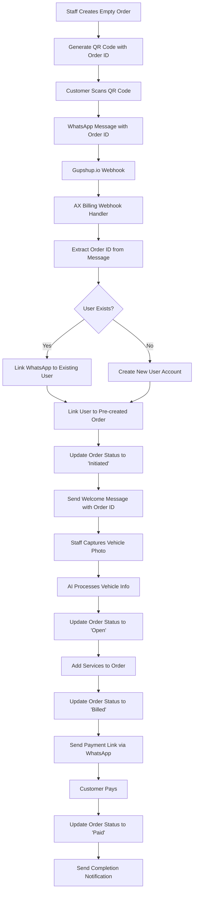

# WhatsApp Integration for AX Billing System

## Overview

WhatsApp integration is a central component of the AX Billing customer journey, providing seamless communication from initial contact through service completion and payment. This integration uses Gupshup.io as the WhatsApp Business API provider.

## Architecture Overview



## Customer Journey Flow


### 1. Initial Contact & Order Pre-Creation
- **Reserve Order ID**: Staff creates an empty order and gets unique order ID (e.g., AX-20241206-1234)
- **QR Code Display**: Staff shows QR code or customer accesses link with embedded order ID
- **WhatsApp Link Format**: `https://wa.me/60172207030?text=Hi-Welcome-To-AX:OrderId-[AX-20241206-1234]`
- **Customer Action**: Scans QR code or clicks link, sends initial message with order ID
- **Order Linking**: System extracts order ID from message and links customer to pre-created order

### 2. Order Stages & Workflow

#### Order Status Progression:
1. **Initiated**: Customer has scanned QR code and sent initial message
2. **Open**: Vehicle information added, services can be selected and added
3. **Billed**: Order completed, payment due/payment link sent via WhatsApp
4. **Paid**: Customer has completed payment successfully

#### Staff Interface Requirements:
- **Initiated Orders Dashboard**: Display all orders in "initiated" status awaiting vehicle information
- **Vehicle Capture Interface**: Camera integration for vehicle photo capture
- **AI Processing Integration**: Automatic vehicle type classification and license plate extraction
- **Service Selection Interface**: Add/modify services for the order
- **Order Management**: Move orders through status progression

### 3. Vehicle Information Capture Process
- **Photo Capture**: Staff takes picture of customer's vehicle
- **AI Classification**: Use OpenRouter/vision model to:
  - Classify vehicle type (sedan, SUV, motorcycle, etc.)
  - Extract license plate number using OCR
  - Validate extracted information
- **Database Updates**:
  - Create/update vehicle record in vehicles collection
  - Link vehicle to customer and order
  - Update order status to "open"
- **Customer Notification**: Send WhatsApp confirmation with vehicle details

### 4. User Recognition & Order Linking
- System receives webhook from Gupshup.io with customer's WhatsApp number and message
- **Order ID Extraction**: Parse message content to extract order ID using regex pattern
- **Order Validation**: Verify order exists and is in correct status for linking
- **User Linking Process**:
  - Check if WhatsApp number exists in user database
  - **Existing User**: Link WhatsApp number to existing account and pre-created order
  - **New User**: Create new customer account and link to order
- **Order Status Update**: Change order status from empty to "initiated"
- **Confirmation Message**: Send WhatsApp confirmation with order ID and next steps

### 5. Service Lifecycle Communication
- **Order Confirmation**: Send order ID and welcome message when order moves to "initiated"
- **Vehicle Confirmation**: Notify customer when vehicle details are captured and verified
- **Service Updates**: Real-time updates as services are added to the order
- **Payment Request**: Send Fiuu payment gateway link when order status changes to "billed"
- **Payment Confirmation**: Confirm payment received, update status to "paid"
- **Completion Notification**: Send pickup notification and digital receipt

### 6. 24-Hour Communication Window
- Leverage WhatsApp's 24-hour messaging window after customer initiates contact
- Send proactive updates within this window for order progression
- Use approved message templates for communications outside the window
- Track communication window expiry for each customer interaction
- Check if WhatsApp number exists in user database
- **Existing User**: Link message to existing account, send personalized welcome
- **New User**: Create new customer account, initiate onboarding flow

### 3. Service Lifecycle Communication
- **Order Confirmation**: Send order details and estimated completion time
- **Status Updates**: Real-time updates as service progresses
- **Payment Request**: Send Fiuu payment gateway link when service is ready
- **Completion**: Send pickup notification and receipt

### 4. 24-Hour Communication Window
- Leverage WhatsApp's 24-hour messaging window after customer initiates contact
- Send proactive updates within this window
- Use message templates for communications outside the window

## Technical Implementation

### Environment Variables Required

```env
# WhatsApp Integration (Gupshup.io)
GUPSHUP_API_KEY=your_gupshup_api_key
GUPSHUP_APP_NAME=your_app_name
GUPSHUP_SOURCE_NUMBER=60172207030
GUPSHUP_WEBHOOK_URL=https://your-domain.com/api/webhooks/whatsapp
GUPSHUP_WEBHOOK_SECRET=your_webhook_secret

# WhatsApp Business Configuration
WHATSAPP_BUSINESS_NUMBER=60172207030
WHATSAPP_QR_LINK=https://ax.ft.tc
WHATSAPP_WELCOME_TEMPLATE=welcome_template_name

# Fiuu Payment Integration
FIUU_MERCHANT_ID=your_merchant_id
FIUU_VERIFY_KEY=your_verify_key
FIUU_SECRET_KEY=your_secret_key
FIUU_SANDBOX_MODE=true

# Application URLs
NEXT_PUBLIC_APP_URL=https://your-domain.com
WEBHOOK_BASE_URL=https://your-domain.com/api/webhooks
```

### Database Schema Enhancements

#### Enhanced Order Collection
The existing Orders collection needs additional fields for the new workflow:

```typescript
// Add to Orders collection
{
  orderStage: 'empty' | 'initiated' | 'open' | 'billed' | 'paid',
  whatsappLinked: boolean,
  whatsappNumber: string,
  qrCodeGenerated: boolean,
  qrCodeScannedAt: Date,
  vehicleCapturedAt: Date,
  aiProcessedAt: Date,
  paymentLinkSentAt: Date,
}
```

#### Enhanced User Collection
The existing User collection already includes `whatsappNumber` field. Additional fields needed:

```typescript
// Add to Users collection
{
  whatsappVerified: boolean,
  whatsappOptIn: boolean,
  lastWhatsappContact: Date,
  whatsappConversationId: string,
  linkedOrders: relationship to Orders[], // Track all linked orders
}

// New WhatsAppMessages collection
{
  id: string,
  conversationId: string,
  user: relationship to Users,
  messageId: string,
  direction: 'inbound' | 'outbound',
  messageType: 'text' | 'template' | 'media',
  content: string,
  status: 'sent' | 'delivered' | 'read' | 'failed',
  timestamp: Date,
  metadata: object,
}

// New WhatsAppTemplates collection
{
  id: string,
  name: string,
  templateId: string,
  category: 'order_confirmation' | 'status_update' | 'payment_request' | 'completion',
  content: string,
  variables: string[],
  isActive: boolean,
}
```

### API Endpoints Structure

```typescript
// Webhook endpoints
POST /api/webhooks/whatsapp          // Receive messages from Gupshup.io
POST /api/webhooks/whatsapp/status   // Receive delivery status updates

// Order Management endpoints
POST /api/orders/create-empty        // Create empty order and return order ID
GET  /api/orders/initiated           // Get all orders in 'initiated' status
POST /api/orders/:id/link-whatsapp   // Link WhatsApp number to order
POST /api/orders/:id/update-stage    // Update order stage
POST /api/orders/:id/add-vehicle     // Add vehicle information to order
POST /api/orders/:id/process-ai      // Trigger AI processing for vehicle

// WhatsApp API endpoints
POST /api/whatsapp/send-message      // Send individual messages
POST /api/whatsapp/send-template     // Send template messages
GET  /api/whatsapp/conversation/:id  // Get conversation history
POST /api/whatsapp/opt-in            // Handle user opt-in
POST /api/whatsapp/opt-out           // Handle user opt-out
POST /api/whatsapp/extract-order-id  // Extract order ID from message

// QR Code and onboarding
POST /api/whatsapp/qr-code           // Generate QR code with order ID
GET  /api/whatsapp/link/:orderId     // Generate WhatsApp link with order ID
POST /api/whatsapp/verify-user       // Verify and link user to order

// Staff Interface endpoints
GET  /api/staff/initiated-orders     // Get dashboard of initiated orders
POST /api/staff/capture-vehicle      // Handle vehicle photo capture
GET  /api/staff/order-progress/:id   // Get order progress status
```

### Core Service Classes

#### 1. WhatsApp Service (`src/lib/whatsapp/whatsapp-service.ts`)

```typescript
export class WhatsAppService {
  private apiKey: string
  private appName: string
  private sourceNumber: string

  constructor() {
    this.apiKey = process.env.GUPSHUP_API_KEY!
    this.appName = process.env.GUPSHUP_APP_NAME!
    this.sourceNumber = process.env.GUPSHUP_SOURCE_NUMBER!
  }

  // Send text message
  async sendMessage(to: string, message: string): Promise<boolean>

  // Send template message
  async sendTemplate(to: string, templateId: string, variables: object): Promise<boolean>

  // Send media message
  async sendMedia(to: string, mediaUrl: string, caption?: string): Promise<boolean>

  // Verify webhook signature
  verifyWebhookSignature(payload: string, signature: string): boolean

  // Process incoming message
  async processIncomingMessage(webhookData: any): Promise<void>
}
```

#### 2. Order Linking Service (`src/lib/whatsapp/order-linking-service.ts`)

```typescript
export class OrderLinkingService {
  // Extract order ID from WhatsApp message
  extractOrderId(messageContent: string): string | null

  // Link WhatsApp number to pre-created order
  async linkWhatsAppToOrder(whatsappNumber: string, orderId: string): Promise<Order>

  // Create new user and link to order
  async createUserAndLinkOrder(whatsappNumber: string, orderId: string, name?: string): Promise<User>

  // Find user by WhatsApp number
  async findUserByWhatsApp(whatsappNumber: string): Promise<User | null>

  // Update order stage
  async updateOrderStage(orderId: string, stage: OrderStage): Promise<Order>

  // Validate order for linking
  async validateOrderForLinking(orderId: string): Promise<boolean>
}
```

#### 3. Vehicle Processing Service (`src/lib/whatsapp/vehicle-processing-service.ts`)

```typescript
export class VehicleProcessingService {
  // Process vehicle photo with AI
  async processVehiclePhoto(photoUrl: string, orderId: string): Promise<VehicleInfo>

  // Extract license plate using OCR
  async extractLicensePlate(photoUrl: string): Promise<string>

  // Classify vehicle type using AI
  async classifyVehicleType(photoUrl: string): Promise<VehicleType>

  // Create or update vehicle record
  async createOrUpdateVehicle(vehicleInfo: VehicleInfo, customerId: string): Promise<Vehicle>

  // Link vehicle to order
  async linkVehicleToOrder(vehicleId: string, orderId: string): Promise<Order>
}
```

#### 3. Notification Service (`src/lib/whatsapp/notification-service.ts`)

```typescript
export class WhatsAppNotificationService {
  private whatsappService: WhatsAppService

  constructor() {
    this.whatsappService = new WhatsAppService()
  }

  // Order lifecycle notifications
  async sendOrderConfirmation(order: Order): Promise<void>
  async sendStatusUpdate(order: Order, status: string): Promise<void>
  async sendPaymentRequest(order: Order, paymentLink: string): Promise<void>
  async sendCompletionNotification(order: Order): Promise<void>

  // Customer onboarding
  async sendWelcomeMessage(user: User): Promise<void>
  async sendVerificationCode(whatsappNumber: string, code: string): Promise<void>

  // Service reminders
  async sendServiceReminder(user: User, reminderType: string): Promise<void>
  async sendPromotionalMessage(user: User, promotion: any): Promise<void>
}
```

#### 4. QR Code Service (`src/lib/whatsapp/qr-service.ts`)

```typescript
export class QRCodeService {
  // Generate QR code for WhatsApp onboarding
  async generateWhatsAppQR(customMessage?: string): Promise<string>

  // Generate dynamic QR with tracking
  async generateTrackedQR(staffId: string, location?: string): Promise<string>

  // Generate WhatsApp link
  generateWhatsAppLink(message?: string): string

  // Track QR code scans
  async trackQRScan(qrId: string, metadata: any): Promise<void>
}
```

### Message Templates

#### Template Categories and Examples

```typescript
// Order Initiated Template
const ORDER_INITIATED = {
  name: "order_initiated",
  content: `🎉 *Welcome to AX Billing!*

Your order has been created:
Order ID: {{orderID}}

Our staff will now capture your vehicle information and add the services you need. We'll keep you updated throughout the process!

Thank you for choosing AX Billing! 🚗✨`,
  variables: ["orderID"]
}

// Vehicle Captured Template
const VEHICLE_CAPTURED = {
  name: "vehicle_captured",
  content: `� *Vehicle Information Captured*

Order ID: {{orderID}}
Vehicle: {{vehicleType}}
License Plate: {{licensePlate}}

Our team is now selecting the appropriate services for your vehicle. You'll receive an update shortly!`,
  variables: ["orderID", "vehicleType", "licensePlate"]
}

// Services Added Template
const SERVICES_ADDED = {
  name: "services_added",
  content: `🔧 *Services Selected*

Order ID: {{orderID}}
Vehicle: {{vehicleType}} - {{licensePlate}}
Services: {{services}}
Total: RM {{totalAmount}}

Your order is now being processed. We'll notify you when it's ready for payment!`,
  variables: ["orderID", "vehicleType", "licensePlate", "services", "totalAmount"]
}

// Status Update Template
const STATUS_UPDATE = {
  name: "status_update",
  content: `🔄 *Service Update*

Order: {{orderID}}
Status: {{status}}
{{#if nextStep}}Next: {{nextStep}}{{/if}}
{{#if estimatedCompletion}}ETA: {{estimatedCompletion}}{{/if}}

Track your service: {{trackingLink}}`,
  variables: ["orderID", "status", "nextStep", "estimatedCompletion", "trackingLink"]
}

// Payment Request Template
const PAYMENT_REQUEST = {
  name: "payment_request",
  content: `💳 *Payment Required*

Your {{vehicleType}} service is complete!
Order: {{orderID}}
Total: RM {{totalAmount}}

Pay now: {{paymentLink}}

Valid for 24 hours. Contact us if you need assistance.`,
  variables: ["vehicleType", "orderID", "totalAmount", "paymentLink"]
}

// Service Completion Template
const SERVICE_COMPLETION = {
  name: "service_completion",
  content: `✅ *Service Complete!*

Your {{vehicleType}} is ready for pickup!
Order: {{orderID}}
Location: {{pickupLocation}}

Thank you for choosing AX Billing!
Rate your experience: {{feedbackLink}}`,
  variables: ["vehicleType", "orderID", "pickupLocation", "feedbackLink"]
}
```

### Webhook Implementation

#### Gupshup.io Webhook Handler (`src/app/api/webhooks/whatsapp/route.ts`)

```typescript
import { NextRequest, NextResponse } from 'next/server'
import { WhatsAppService } from '@/lib/whatsapp/whatsapp-service'
import { UserLinkingService } from '@/lib/whatsapp/user-linking-service'
import { getPayload } from 'payload'
import config from '@/payload.config'

const whatsappService = new WhatsAppService()
const userLinkingService = new UserLinkingService()

export async function POST(request: NextRequest) {
  try {
    const payload = await getPayload({ config })
    const body = await request.text()
    const signature = request.headers.get('x-gupshup-signature')

    // Verify webhook signature
    if (!whatsappService.verifyWebhookSignature(body, signature)) {
      return NextResponse.json({ error: 'Invalid signature' }, { status: 401 })
    }

    const webhookData = JSON.parse(body)

    // Process different message types
    switch (webhookData.type) {
      case 'message':
        await handleIncomingMessage(webhookData, payload)
        break
      case 'message-event':
        await handleMessageStatus(webhookData, payload)
        break
      default:
        console.log('Unknown webhook type:', webhookData.type)
    }

    return NextResponse.json({ success: true })
  } catch (error) {
    console.error('WhatsApp webhook error:', error)
    return NextResponse.json({ error: 'Internal server error' }, { status: 500 })
  }
}

async function handleIncomingMessage(data: any, payload: any) {
  const { mobile, text, name } = data.payload

  // Extract order ID from message
  const orderLinkingService = new OrderLinkingService()
  const orderId = orderLinkingService.extractOrderId(text)

  if (!orderId) {
    // No order ID found - send error message
    await whatsappService.sendMessage(mobile,
      "❌ Invalid QR code. Please scan the QR code provided by our staff to start your service."
    )
    return
  }

  // Validate order exists and is linkable
  const isValidOrder = await orderLinkingService.validateOrderForLinking(orderId)
  if (!isValidOrder) {
    await whatsappService.sendMessage(mobile,
      `❌ Order ${orderId} is not available for linking. Please contact our staff for assistance.`
    )
    return
  }

  // Find or create user and link to order
  let user = await orderLinkingService.findUserByWhatsApp(mobile)

  if (!user) {
    // New customer - create account and link to order
    user = await orderLinkingService.createUserAndLinkOrder(mobile, orderId, name)
  } else {
    // Existing customer - link to order
    await orderLinkingService.linkWhatsAppToOrder(mobile, orderId)
  }

  // Update order status to 'initiated'
  await orderLinkingService.updateOrderStage(orderId, 'initiated')

  // Send order initiated confirmation
  await whatsappService.sendTemplate(mobile, 'order_initiated', {
    orderID: orderId
  })

  // Log message
  await payload.create({
    collection: 'whatsapp-messages',
    data: {
      user: user.id,
      messageId: data.payload.id,
      direction: 'inbound',
      messageType: 'text',
      content: text,
      status: 'received',
      timestamp: new Date(),
      metadata: data
    }
  })
}

async function handleMessageStatus(data: any, payload: any) {
  // Update message delivery status
  const { messageId, status } = data.payload

  await payload.update({
    collection: 'whatsapp-messages',
    where: { messageId: { equals: messageId } },
    data: { status }
  })
}
```

### Integration with Existing Order System

#### Order Hooks Enhancement (`src/collections/Orders.ts`)

```typescript
// Add to existing Orders collection hooks
hooks: {
  afterChange: [
    async ({ doc, operation, req }) => {
      const { WhatsAppNotificationService } = await import('@/lib/whatsapp/notification-service')
      const notificationService = new WhatsAppNotificationService()

      if (operation === 'create') {
        // Send order confirmation
        await notificationService.sendOrderConfirmation(doc)
      }

      if (operation === 'update') {
        // Check for status changes
        const previousDoc = req.context.previousDoc

        if (doc.overallStatus !== previousDoc?.overallStatus) {
          await notificationService.sendStatusUpdate(doc, doc.overallStatus)
        }

        // Check for payment status changes
        if (doc.paymentStatus === 'pending' && previousDoc?.paymentStatus !== 'pending') {
          const paymentLink = await generateFiuuPaymentLink(doc)
          await notificationService.sendPaymentRequest(doc, paymentLink)
        }

        // Check for completion
        if (doc.overallStatus === 'ready' && previousDoc?.overallStatus !== 'ready') {
          await notificationService.sendCompletionNotification(doc)
        }
      }
    }
  ]
}

// Helper function for Fiuu payment link generation
async function generateFiuuPaymentLink(order: Order): Promise<string> {
  const fiuuService = new FiuuPaymentService()
  return await fiuuService.generatePaymentLink({
    orderId: order.orderID,
    amount: order.totalAmount,
    customerEmail: order.customer.email,
    customerPhone: order.customer.whatsappNumber,
    description: `Car wash service - ${order.orderID}`
  })
}
```

#### User Collection Enhancement (`src/collections/Users.ts`)

```typescript
// Add WhatsApp-specific fields to existing Users collection
{
  name: 'whatsappVerified',
  type: 'checkbox',
  label: 'WhatsApp Verified',
  defaultValue: false,
  admin: {
    description: 'Whether the WhatsApp number has been verified'
  }
},
{
  name: 'whatsappOptIn',
  type: 'checkbox',
  label: 'WhatsApp Opt-in',
  defaultValue: true,
  admin: {
    description: 'User consent for WhatsApp notifications'
  }
},
{
  name: 'lastWhatsappContact',
  type: 'date',
  label: 'Last WhatsApp Contact',
  admin: {
    description: 'Last time customer initiated WhatsApp contact (for 24h window)'
  }
},
{
  name: 'whatsappConversationId',
  type: 'text',
  label: 'WhatsApp Conversation ID',
  admin: {
    description: 'Gupshup conversation identifier'
  }
}
```

### New Collections Required

#### WhatsApp Messages Collection (`src/collections/WhatsAppMessages.ts`)

```typescript
import type { CollectionConfig } from 'payload'

export const WhatsAppMessages: CollectionConfig = {
  slug: 'whatsapp-messages',
  admin: {
    useAsTitle: 'content',
    defaultColumns: ['user', 'direction', 'messageType', 'status', 'timestamp'],
  },
  fields: [
    {
      name: 'user',
      type: 'relationship',
      relationTo: 'users',
      required: true,
      label: 'User',
    },
    {
      name: 'messageId',
      type: 'text',
      required: true,
      unique: true,
      label: 'Message ID',
    },
    {
      name: 'conversationId',
      type: 'text',
      label: 'Conversation ID',
    },
    {
      name: 'direction',
      type: 'select',
      required: true,
      options: [
        { label: 'Inbound', value: 'inbound' },
        { label: 'Outbound', value: 'outbound' },
      ],
    },
    {
      name: 'messageType',
      type: 'select',
      required: true,
      options: [
        { label: 'Text', value: 'text' },
        { label: 'Template', value: 'template' },
        { label: 'Media', value: 'media' },
      ],
    },
    {
      name: 'content',
      type: 'textarea',
      required: true,
      label: 'Message Content',
    },
    {
      name: 'status',
      type: 'select',
      required: true,
      options: [
        { label: 'Sent', value: 'sent' },
        { label: 'Delivered', value: 'delivered' },
        { label: 'Read', value: 'read' },
        { label: 'Failed', value: 'failed' },
        { label: 'Received', value: 'received' },
      ],
    },
    {
      name: 'metadata',
      type: 'json',
      label: 'Metadata',
    },
  ],
}
```

#### WhatsApp Templates Collection (`src/collections/WhatsAppTemplates.ts`)

```typescript
import type { CollectionConfig } from 'payload'

export const WhatsAppTemplates: CollectionConfig = {
  slug: 'whatsapp-templates',
  admin: {
    useAsTitle: 'name',
    defaultColumns: ['name', 'category', 'isActive'],
  },
  fields: [
    {
      name: 'name',
      type: 'text',
      required: true,
      unique: true,
      label: 'Template Name',
    },
    {
      name: 'templateId',
      type: 'text',
      required: true,
      label: 'Gupshup Template ID',
    },
    {
      name: 'category',
      type: 'select',
      required: true,
      options: [
        { label: 'Order Confirmation', value: 'order_confirmation' },
        { label: 'Status Update', value: 'status_update' },
        { label: 'Payment Request', value: 'payment_request' },
        { label: 'Service Completion', value: 'completion' },
        { label: 'Welcome Message', value: 'welcome' },
        { label: 'Promotional', value: 'promotional' },
      ],
    },
    {
      name: 'content',
      type: 'textarea',
      required: true,
      label: 'Template Content',
    },
    {
      name: 'variables',
      type: 'array',
      label: 'Template Variables',
      fields: [
        {
          name: 'variable',
          type: 'text',
          required: true,
        },
      ],
    },
    {
      name: 'isActive',
      type: 'checkbox',
      defaultValue: true,
      label: 'Active',
    },
  ],
}
```

### Staff Interface Implementation

#### Initiated Orders Dashboard (`src/components/staff/InitiatedOrdersDashboard.tsx`)

```typescript
'use client'

import { useState, useEffect } from 'react'
import { Card, CardContent, CardHeader, CardTitle } from '@/components/ui/card'
import { Button } from '@/components/ui/button'
import { Badge } from '@/components/ui/badge'

interface InitiatedOrder {
  id: string
  orderID: string
  whatsappNumber: string
  customerName?: string
  createdAt: string
  qrCodeScannedAt: string
}

export function InitiatedOrdersDashboard() {
  const [orders, setOrders] = useState<InitiatedOrder[]>([])
  const [isLoading, setIsLoading] = useState(true)

  useEffect(() => {
    fetchInitiatedOrders()
    // Set up real-time updates
    const interval = setInterval(fetchInitiatedOrders, 30000) // Refresh every 30 seconds
    return () => clearInterval(interval)
  }, [])

  const fetchInitiatedOrders = async () => {
    try {
      const response = await fetch('/api/staff/initiated-orders')
      const data = await response.json()
      setOrders(data.orders)
    } catch (error) {
      console.error('Failed to fetch initiated orders:', error)
    } finally {
      setIsLoading(false)
    }
  }

  const handleProcessOrder = (orderId: string) => {
    // Navigate to vehicle capture interface
    window.location.href = `/staff/orders/${orderId}/capture-vehicle`
  }

  if (isLoading) {
    return <div className="animate-pulse">Loading initiated orders...</div>
  }

  return (
    <div className="space-y-6">
      <div className="flex items-center justify-between">
        <h2 className="text-2xl font-bold">Initiated Orders</h2>
        <Badge variant="secondary">{orders.length} pending</Badge>
      </div>

      <div className="grid gap-4">
        {orders.map((order) => (
          <Card key={order.id} className="border-l-4 border-l-yellow-500">
            <CardHeader>
              <div className="flex items-center justify-between">
                <CardTitle className="text-lg">{order.orderID}</CardTitle>
                <Badge variant="warning">Initiated</Badge>
              </div>
            </CardHeader>
            <CardContent>
              <div className="grid grid-cols-2 gap-4 mb-4">
                <div>
                  <p className="text-sm text-gray-600">Customer</p>
                  <p className="font-medium">{order.customerName || 'New Customer'}</p>
                </div>
                <div>
                  <p className="text-sm text-gray-600">WhatsApp</p>
                  <p className="font-medium">{order.whatsappNumber}</p>
                </div>
                <div>
                  <p className="text-sm text-gray-600">QR Scanned</p>
                  <p className="font-medium">{new Date(order.qrCodeScannedAt).toLocaleTimeString()}</p>
                </div>
                <div>
                  <p className="text-sm text-gray-600">Waiting Time</p>
                  <p className="font-medium text-yellow-600">
                    {Math.floor((Date.now() - new Date(order.qrCodeScannedAt).getTime()) / 60000)} min
                  </p>
                </div>
              </div>
              <Button
                onClick={() => handleProcessOrder(order.id)}
                className="w-full"
              >
                Capture Vehicle Information
              </Button>
            </CardContent>
          </Card>
        ))}
      </div>

      {orders.length === 0 && (
        <Card>
          <CardContent className="text-center py-8">
            <p className="text-gray-500">No initiated orders at the moment</p>
            <p className="text-sm text-gray-400 mt-2">
              Orders will appear here when customers scan QR codes
            </p>
          </CardContent>
        </Card>
      )}
    </div>
  )
}
```

#### Vehicle Capture Interface (`src/components/staff/VehicleCaptureInterface.tsx`)

```typescript
'use client'

import { useState } from 'react'
import { Card, CardContent, CardHeader, CardTitle } from '@/components/ui/card'
import { Button } from '@/components/ui/button'
import { Camera, Upload, Loader2 } from 'lucide-react'

interface VehicleCaptureProps {
  orderId: string
  orderDetails: {
    orderID: string
    customerName: string
    whatsappNumber: string
  }
}

export function VehicleCaptureInterface({ orderId, orderDetails }: VehicleCaptureProps) {
  const [isCapturing, setIsCapturing] = useState(false)
  const [isProcessing, setIsProcessing] = useState(false)
  const [capturedImage, setCapturedImage] = useState<string | null>(null)
  const [vehicleInfo, setVehicleInfo] = useState<any>(null)

  const handleCameraCapture = async () => {
    setIsCapturing(true)
    try {
      // Implement camera capture logic
      const stream = await navigator.mediaDevices.getUserMedia({ video: true })
      // Camera capture implementation
    } catch (error) {
      console.error('Camera access failed:', error)
    } finally {
      setIsCapturing(false)
    }
  }

  const handleFileUpload = async (event: React.ChangeEvent<HTMLInputElement>) => {
    const file = event.target.files?.[0]
    if (!file) return

    setIsProcessing(true)
    try {
      const formData = new FormData()
      formData.append('image', file)
      formData.append('orderId', orderId)

      const response = await fetch('/api/staff/capture-vehicle', {
        method: 'POST',
        body: formData
      })

      const result = await response.json()
      setCapturedImage(URL.createObjectURL(file))
      setVehicleInfo(result.vehicleInfo)
    } catch (error) {
      console.error('Vehicle processing failed:', error)
    } finally {
      setIsProcessing(false)
    }
  }

  const handleConfirmVehicle = async () => {
    try {
      await fetch(`/api/orders/${orderId}/update-stage`, {
        method: 'POST',
        headers: { 'Content-Type': 'application/json' },
        body: JSON.stringify({ stage: 'open' })
      })

      // Navigate to service selection
      window.location.href = `/staff/orders/${orderId}/select-services`
    } catch (error) {
      console.error('Failed to update order stage:', error)
    }
  }

  return (
    <div className="space-y-6">
      <Card>
        <CardHeader>
          <CardTitle>Order: {orderDetails.orderID}</CardTitle>
          <p className="text-sm text-gray-600">
            Customer: {orderDetails.customerName} ({orderDetails.whatsappNumber})
          </p>
        </CardHeader>
      </Card>

      <Card>
        <CardHeader>
          <CardTitle>Capture Vehicle Information</CardTitle>
        </CardHeader>
        <CardContent className="space-y-4">
          <div className="grid grid-cols-2 gap-4">
            <Button
              onClick={handleCameraCapture}
              disabled={isCapturing || isProcessing}
              className="h-32 flex-col"
            >
              <Camera className="w-8 h-8 mb-2" />
              {isCapturing ? 'Opening Camera...' : 'Use Camera'}
            </Button>

            <label className="cursor-pointer">
              <Button
                asChild
                disabled={isProcessing}
                className="h-32 flex-col w-full"
              >
                <div>
                  <Upload className="w-8 h-8 mb-2" />
                  Upload Photo
                </div>
              </Button>
              <input
                type="file"
                accept="image/*"
                onChange={handleFileUpload}
                className="hidden"
              />
            </label>
          </div>

          {isProcessing && (
            <div className="flex items-center justify-center py-8">
              <Loader2 className="w-8 h-8 animate-spin mr-2" />
              <span>Processing vehicle information with AI...</span>
            </div>
          )}

          {capturedImage && (
            <div className="space-y-4">
              

              {vehicleInfo && (
                <Card>
                  <CardHeader>
                    <CardTitle className="text-lg">AI Analysis Results</CardTitle>
                  </CardHeader>
                  <CardContent>
                    <div className="grid grid-cols-2 gap-4">
                      <div>
                        <p className="text-sm text-gray-600">Vehicle Type</p>
                        <p className="font-medium">{vehicleInfo.vehicleType}</p>
                      </div>
                      <div>
                        <p className="text-sm text-gray-600">License Plate</p>
                        <p className="font-medium">{vehicleInfo.licensePlate}</p>
                      </div>
                    </div>
                    <Button
                      onClick={handleConfirmVehicle}
                      className="w-full mt-4"
                    >
                      Confirm & Continue to Services
                    </Button>
                  </CardContent>
                </Card>
              )}
            </div>
          )}
        </CardContent>
      </Card>
    </div>
  )
}
```

### QR Code Implementation

#### Enhanced QR Code Component (`src/components/whatsapp/WhatsAppQRCode.tsx`)

```typescript
'use client'

import { useState, useEffect } from 'react'
import { QRCodeSVG } from 'qrcode.react'
import { Card, CardContent, CardHeader, CardTitle } from '@/components/ui/card'

interface WhatsAppQRCodeProps {
  orderId?: string
  staffId?: string
  location?: string
  onOrderCreated?: (orderId: string) => void
}

export function WhatsAppQRCode({ orderId, staffId, location, onOrderCreated }: WhatsAppQRCodeProps) {
  const [qrValue, setQrValue] = useState('')
  const [isLoading, setIsLoading] = useState(true)
  const [currentOrderId, setCurrentOrderId] = useState(orderId)

  useEffect(() => {
    if (currentOrderId) {
      generateQRCodeWithOrder()
    } else {
      createOrderAndGenerateQR()
    }
  }, [currentOrderId, staffId, location])

  const createOrderAndGenerateQR = async () => {
    try {
      // Create empty order first
      const orderResponse = await fetch('/api/orders/create-empty', {
        method: 'POST',
        headers: { 'Content-Type': 'application/json' },
        body: JSON.stringify({ staffId, location })
      })

      const orderData = await orderResponse.json()
      const newOrderId = orderData.orderID

      setCurrentOrderId(newOrderId)
      onOrderCreated?.(newOrderId)

      // Generate QR code with order ID
      await generateQRCodeWithOrder(newOrderId)
    } catch (error) {
      console.error('Failed to create order and generate QR code:', error)
    }
  }

  const generateQRCodeWithOrder = async (orderIdToUse?: string) => {
    try {
      const orderIdForQR = orderIdToUse || currentOrderId
      const response = await fetch('/api/whatsapp/qr-code', {
        method: 'POST',
        headers: { 'Content-Type': 'application/json' },
        body: JSON.stringify({
          orderId: orderIdForQR,
          staffId,
          location
        })
      })

      const data = await response.json()
      setQrValue(data.qrValue)
    } catch (error) {
      console.error('Failed to generate QR code:', error)
    } finally {
      setIsLoading(false)
    }
  }

  if (isLoading) {
    return <div className="animate-pulse bg-gray-200 w-64 h-64 rounded-lg" />
  }

  return (
    <Card className="w-fit">
      <CardHeader>
        <CardTitle className="text-center">Scan to Start Service</CardTitle>
        {currentOrderId && (
          <p className="text-center text-sm text-gray-600">
            Order ID: <span className="font-mono font-bold">{currentOrderId}</span>
          </p>
        )}
      </CardHeader>
      <CardContent className="flex flex-col items-center space-y-4">
        <QRCodeSVG
          value={qrValue}
          size={256}
          level="M"
          includeMargin={true}
          className="border-2 border-gray-200 rounded-lg"
        />
        <div className="text-center max-w-xs">
          <p className="text-sm text-gray-600 mb-2">
            Scan this QR code with your phone to start your car wash service via WhatsApp
          </p>
          {currentOrderId && (
            <p className="text-xs text-gray-500">
              This QR code is linked to order {currentOrderId}
            </p>
          )}
        </div>
      </CardContent>
    </Card>
  )
}
```

#### QR Code API Route (`src/app/api/whatsapp/qr-code/route.ts`)

```typescript
import { NextRequest, NextResponse } from 'next/server'
import { QRCodeService } from '@/lib/whatsapp/qr-service'

const qrService = new QRCodeService()

export async function POST(request: NextRequest) {
  try {
    const { orderId, staffId, location } = await request.json()

    if (!orderId) {
      return NextResponse.json({ error: 'Order ID is required' }, { status: 400 })
    }

    // Generate WhatsApp link with order ID
    const whatsappLink = qrService.generateWhatsAppLinkWithOrder(orderId)

    // Track QR generation
    await qrService.trackQRGeneration(orderId, staffId, location)

    return NextResponse.json({ qrValue: whatsappLink })
  } catch (error) {
    console.error('QR code generation error:', error)
    return NextResponse.json({ error: 'Failed to generate QR code' }, { status: 500 })
  }
}

export async function GET() {
  try {
    // Generate basic WhatsApp link without order ID (fallback)
    const qrValue = qrService.generateWhatsAppLink()
    return NextResponse.json({ qrValue })
  } catch (error) {
    console.error('QR code generation error:', error)
    return NextResponse.json({ error: 'Failed to generate QR code' }, { status: 500 })
  }
}
```

#### Order Creation API Route (`src/app/api/orders/create-empty/route.ts`)

```typescript
import { NextRequest, NextResponse } from 'next/server'
import { getPayload } from 'payload'
import config from '@/payload.config'

export async function POST(request: NextRequest) {
  try {
    const payload = await getPayload({ config })
    const { staffId, location } = await request.json()

    // Generate unique order ID
    const date = new Date()
    const dateStr = date.toISOString().slice(0, 10).replace(/-/g, '')
    const random = Math.floor(Math.random() * 9999).toString().padStart(4, '0')
    const orderID = `AX-${dateStr}-${random}`

    // Create empty order
    const order = await payload.create({
      collection: 'orders',
      data: {
        orderID,
        orderStage: 'empty',
        qrCodeGenerated: true,
        totalAmount: 0,
        paymentStatus: 'pending',
        overallStatus: 'pending',
        queue: 'regular',
        // Add metadata
        metadata: {
          staffId,
          location,
          createdVia: 'qr_code'
        }
      }
    })

    return NextResponse.json({
      orderID: order.orderID,
      id: order.id
    })
  } catch (error) {
    console.error('Order creation error:', error)
    return NextResponse.json({ error: 'Failed to create order' }, { status: 500 })
  }
}
```

### Admin Interface Components

#### WhatsApp Dashboard (`src/components/admin/WhatsAppDashboard.tsx`)

```typescript
'use client'

import { useState, useEffect } from 'react'
import { Card, CardContent, CardHeader, CardTitle } from '@/components/ui/card'
import { Badge } from '@/components/ui/badge'
import { Button } from '@/components/ui/button'

interface WhatsAppStats {
  totalMessages: number
  activeConversations: number
  deliveryRate: number
  responseTime: number
}

export function WhatsAppDashboard() {
  const [stats, setStats] = useState<WhatsAppStats | null>(null)
  const [recentMessages, setRecentMessages] = useState([])

  useEffect(() => {
    fetchStats()
    fetchRecentMessages()
  }, [])

  const fetchStats = async () => {
    try {
      const response = await fetch('/api/whatsapp/stats')
      const data = await response.json()
      setStats(data)
    } catch (error) {
      console.error('Failed to fetch WhatsApp stats:', error)
    }
  }

  const fetchRecentMessages = async () => {
    try {
      const response = await fetch('/api/whatsapp/messages/recent')
      const data = await response.json()
      setRecentMessages(data.messages)
    } catch (error) {
      console.error('Failed to fetch recent messages:', error)
    }
  }

  return (
    <div className="space-y-6">
      <div className="grid grid-cols-1 md:grid-cols-4 gap-4">
        <Card>
          <CardHeader>
            <CardTitle className="text-sm">Total Messages</CardTitle>
          </CardHeader>
          <CardContent>
            <div className="text-2xl font-bold">{stats?.totalMessages || 0}</div>
          </CardContent>
        </Card>

        <Card>
          <CardHeader>
            <CardTitle className="text-sm">Active Conversations</CardTitle>
          </CardHeader>
          <CardContent>
            <div className="text-2xl font-bold">{stats?.activeConversations || 0}</div>
          </CardContent>
        </Card>

        <Card>
          <CardHeader>
            <CardTitle className="text-sm">Delivery Rate</CardTitle>
          </CardHeader>
          <CardContent>
            <div className="text-2xl font-bold">{stats?.deliveryRate || 0}%</div>
          </CardContent>
        </Card>

        <Card>
          <CardHeader>
            <CardTitle className="text-sm">Avg Response Time</CardTitle>
          </CardHeader>
          <CardContent>
            <div className="text-2xl font-bold">{stats?.responseTime || 0}min</div>
          </CardContent>
        </Card>
      </div>

      <Card>
        <CardHeader>
          <CardTitle>Recent Messages</CardTitle>
        </CardHeader>
        <CardContent>
          <div className="space-y-4">
            {recentMessages.map((message: any) => (
              <div key={message.id} className="flex items-center justify-between p-3 border rounded-lg">
                <div>
                  <div className="font-medium">{message.user.firstName} {message.user.lastName}</div>
                  <div className="text-sm text-gray-600">{message.content}</div>
                </div>
                <div className="flex items-center space-x-2">
                  <Badge variant={message.direction === 'inbound' ? 'default' : 'secondary'}>
                    {message.direction}
                  </Badge>
                  <Badge variant={message.status === 'delivered' ? 'success' : 'warning'}>
                    {message.status}
                  </Badge>
                </div>
              </div>
            ))}
          </div>
        </CardContent>
      </Card>
    </div>
  )
}
```

## Deployment and Configuration

### 1. Gupshup.io Setup

1. **Create Gupshup Account**
   - Sign up at [gupshup.io](https://gupshup.io)
   - Verify your business and WhatsApp number (60172207030)
   - Get API credentials

2. **Configure WhatsApp Business API**
   ```bash
   # Set up webhook URL
   curl -X POST "https://api.gupshup.io/sm/api/v1/app/webhook" \
     -H "apikey: YOUR_API_KEY" \
     -H "Content-Type: application/json" \
     -d '{
       "url": "https://your-domain.com/api/webhooks/whatsapp",
       "events": ["message", "message-event"]
     }'
   ```

3. **Create Message Templates**
   - Submit templates for approval in Gupshup dashboard
   - Wait for WhatsApp approval (24-48 hours)
   - Update template IDs in your environment variables

### 2. Environment Configuration

Update your `.env` file with all required variables:

```env
# Existing variables
DATABASE_URI=mongodb://127.0.0.1:27017/ax-billing
PAYLOAD_SECRET=your-super-secret-key

# WhatsApp Integration (Gupshup.io)
GUPSHUP_API_KEY=your_gupshup_api_key
GUPSHUP_APP_NAME=your_app_name
GUPSHUP_SOURCE_NUMBER=60172207030
GUPSHUP_WEBHOOK_URL=https://your-domain.com/api/webhooks/whatsapp
GUPSHUP_WEBHOOK_SECRET=your_webhook_secret

# WhatsApp Business Configuration
WHATSAPP_BUSINESS_NUMBER=60172207030
WHATSAPP_QR_LINK=https://ax.ft.tc
WHATSAPP_WELCOME_TEMPLATE=welcome_template_name

# Fiuu Payment Integration
FIUU_MERCHANT_ID=your_merchant_id
FIUU_VERIFY_KEY=your_verify_key
FIUU_SECRET_KEY=your_secret_key
FIUU_SANDBOX_MODE=true

# Application URLs
NEXT_PUBLIC_APP_URL=https://your-domain.com
WEBHOOK_BASE_URL=https://your-domain.com/api/webhooks
```

### 3. Database Migration

Add new collections to `src/payload.config.ts`:

```typescript
import { WhatsAppMessages } from './collections/WhatsAppMessages'
import { WhatsAppTemplates } from './collections/WhatsAppTemplates'

export default buildConfig({
  collections: [
    Users,
    Vehicles,
    Services,
    ServiceCategories,
    ServiceOptions,
    Orders,
    CustomerTiers,
    Media,
    WhatsAppMessages,    // Add this
    WhatsAppTemplates,   // Add this
  ],
  // ... rest of config
})
```

### 4. Package Dependencies

Install required packages:

```bash
pnpm add qrcode.react axios crypto-js
pnpm add -D @types/qrcode.react
```

## Testing Strategy

### 1. Unit Tests

```typescript
// tests/whatsapp/whatsapp-service.test.ts
import { WhatsAppService } from '@/lib/whatsapp/whatsapp-service'

describe('WhatsAppService', () => {
  let service: WhatsAppService

  beforeEach(() => {
    service = new WhatsAppService()
  })

  test('should send text message successfully', async () => {
    const result = await service.sendMessage('+60123456789', 'Test message')
    expect(result).toBe(true)
  })

  test('should verify webhook signature', () => {
    const payload = '{"test": "data"}'
    const signature = 'valid_signature'
    const result = service.verifyWebhookSignature(payload, signature)
    expect(result).toBe(true)
  })
})
```

### 2. Integration Tests

```typescript
// tests/whatsapp/webhook.integration.test.ts
import { POST } from '@/app/api/webhooks/whatsapp/route'
import { NextRequest } from 'next/server'

describe('WhatsApp Webhook', () => {
  test('should handle incoming message webhook', async () => {
    const request = new NextRequest('http://localhost:3000/api/webhooks/whatsapp', {
      method: 'POST',
      body: JSON.stringify({
        type: 'message',
        payload: {
          mobile: '+60123456789',
          text: 'Hello',
          name: 'Test User'
        }
      }),
      headers: {
        'x-gupshup-signature': 'valid_signature'
      }
    })

    const response = await POST(request)
    expect(response.status).toBe(200)
  })
})
```

### 3. End-to-End Testing

```typescript
// tests/e2e/whatsapp-flow.spec.ts
import { test, expect } from '@playwright/test'

test('WhatsApp onboarding flow', async ({ page }) => {
  // Test QR code generation
  await page.goto('/admin/whatsapp')
  await expect(page.locator('[data-testid="qr-code"]')).toBeVisible()

  // Test webhook simulation
  await page.goto('/admin/whatsapp/test')
  await page.fill('[data-testid="phone-input"]', '+60123456789')
  await page.fill('[data-testid="message-input"]', 'Test message')
  await page.click('[data-testid="send-webhook"]')

  await expect(page.locator('[data-testid="success-message"]')).toBeVisible()
})
```

## Security Considerations

### 1. Webhook Security

- **Signature Verification**: Always verify Gupshup webhook signatures
- **HTTPS Only**: Use HTTPS for all webhook endpoints
- **Rate Limiting**: Implement rate limiting on webhook endpoints
- **IP Whitelisting**: Whitelist Gupshup IP addresses

### 2. Data Protection

- **PII Handling**: Encrypt WhatsApp numbers and message content
- **GDPR Compliance**: Implement data retention policies
- **Opt-out Mechanism**: Provide easy opt-out for users
- **Audit Logging**: Log all WhatsApp interactions

### 3. API Security

```typescript
// Middleware for webhook security
export function verifyWebhookMiddleware(req: NextRequest) {
  const signature = req.headers.get('x-gupshup-signature')
  const body = req.body

  if (!verifySignature(body, signature)) {
    throw new Error('Invalid webhook signature')
  }

  // Rate limiting
  if (isRateLimited(req.ip)) {
    throw new Error('Rate limit exceeded')
  }
}
```

## Monitoring and Analytics

### 1. Key Metrics

- Message delivery rates
- Response times
- Conversion rates (QR scan to order)
- Customer satisfaction scores
- Error rates and failed messages

### 2. Alerting

```typescript
// Alert on high failure rates
if (failureRate > 0.1) {
  await sendAlert('WhatsApp delivery failure rate exceeded 10%')
}

// Alert on webhook downtime
if (webhookDowntime > 300) {
  await sendAlert('WhatsApp webhook has been down for 5+ minutes')
}
```

## Troubleshooting Guide

### Common Issues

1. **Messages not delivering**
   - Check Gupshup API status
   - Verify template approval status
   - Check 24-hour messaging window

2. **Webhook not receiving messages**
   - Verify webhook URL configuration
   - Check SSL certificate validity
   - Verify signature validation

3. **QR code not working**
   - Check WhatsApp link format
   - Verify business number registration
   - Test link manually

### Debug Tools

```typescript
// Debug webhook payload
console.log('Webhook received:', JSON.stringify(webhookData, null, 2))

// Test message sending
await whatsappService.sendMessage('+60123456789', 'Debug test message')

// Verify user linking
const user = await userLinkingService.findUserByWhatsApp('+60123456789')
console.log('Found user:', user)
```

## Next Steps

1. **Phase 1**: Basic messaging and webhook handling
2. **Phase 2**: Advanced templates and automation
3. **Phase 3**: AI-powered responses and analytics
4. **Phase 4**: Multi-language support and chatbot integration

This comprehensive WhatsApp integration will provide seamless customer communication throughout the entire car wash service lifecycle, from initial contact through payment and completion.
```
```
```
```